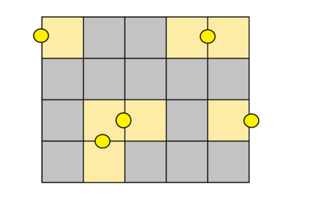
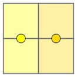
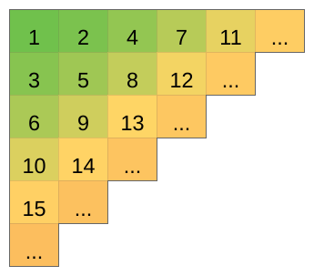

# Codeforces Round #645

1. Park Lighting

- 전구를 놔서 공원 전체를 밝게 하기
- 네모난 격자의 변에 놓을 수 있다.

- 모든 공간을 밝게하는 최소한의 전구 갯수를 구하는 것



테스트 케이스

input

```
5
1 1
1 3
2 2
3 3
5 3
```

output

```
1
2
2
5
8
```


풀이

- 보통 2개의 공간당 1개의 전구가 필요하므로 저겅도 (n*m) / 2 개의 전구가 필요하다.

  ex )

- 즉 가로, 세로가 모두 짝수면  (n*m) / 2
- n과 m이 짝수인 공간에서 한쪽면만 추가 되면 똑같이  (n*m) / 2 의 전구의 갯수가 추가된다.
- 즉 n과 m중 하나만 홀수여도  (n*m) / 2의 공식이 성립
- 하지만 n과 m이 짝수인 공간에서 가로세로가 추가 될 경우 +1의 공간이 더 생기게 된다. =  ((n*m) / 2) +1
- 이 결과 n*m 이 홀수 일때만 +1을 해주면 되는 것!


```java
public class Main {
	static StringTokenizer st;

	public static void main(String[] args) throws NumberFormatException, IOException {
		BufferedReader br = new BufferedReader(new InputStreamReader(System.in));
		int t = Integer.parseInt(br.readLine());
		for (int i = 0; i < t; i++) {
			st = new StringTokenizer(br.readLine());
			int n = Integer.parseInt(st.nextToken());
			int m = Integer.parseInt(st.nextToken());
			
			System.out.println((n*m)%2==0 ? (n*m)/2 : (n*m)/2+1);
		}
	}

}
```


2. B. Maria Breaks the Self-isolation

- 축제에 몇명을 확보할 수 있냐의 문제

- 축제에 참가하고 싶은 할머니는 나빼고 축제에 참가한 사람이 내번호랑 같거나 크면 참가할 수 있다.

- 처음에는 1명이 존재한다.

  ex ) 1 5 4 5 1 9 (정렬해서 보자) = > 1 1 4 5 5 9

  이미 처음에 1명이 존재한다.

  첫번재 할머니 1(1)은 1명이 존재하니 참가한다.

  두번째 할머니 2(1)은 이미 2명이 존재하니 참가한다.

  세번째 할머니 3(4)은 3명밖에 존재하지 못해서 참가못한다.

  네번째 할머니 4(5)은 세번째할머니를 데려가도 참가 못한다.

  다섯번째 할머니 5(5)은 한번에 세번째와 네번째 할머니를 데려가면 참가가능하다.

  답 = 6

- 즉 배열을 정렬한 뒤 누적합 배열을 만든다.

- 뒤쪽부터 탐색하여 조건에 만족하는 최대 값을 찾으면 끝

- ex) 1 1 4 5 5 9  = arr

  ​      1 2 3 4 5 6 = sum

  = > arr[j]<=sum[j] 일 때 sum[j]+1이 답

  ```java
  public class Main {
  	static StringTokenizer st;
  
  	public static void main(String[] args) throws NumberFormatException, IOException {
  		BufferedReader br = new BufferedReader(new InputStreamReader(System.in));
  		int t = Integer.parseInt(br.readLine());
  		for (int i = 0; i < t; i++) {
  			st = new StringTokenizer(br.readLine());
  			int n = Integer.parseInt(st.nextToken());
  			int[] arr = new int[n];
  			int[] sum = new int[n];
  			st = new StringTokenizer(br.readLine());
  			for (int j = 0; j < n; j++) {
  				
  				arr[j] = Integer.parseInt(st.nextToken());
  				sum[j] += j+1;
  			}
  			
  			//1. 정렬
  			Arrays.sort(arr);
  			
  			//2. 뒤에서 부터 조건에 만족하는 지 탐색
  			int result =  1;
  			for (int j = n-1; j >=0; j--) {
  				if(arr[j]<=sum[j]) {
  					result = sum[j]+1;
  					break;
  				}
  			}
  			
  			System.out.println(result);
  		}
  	}
  
  }
  ```

  


3.  Celex Update



- 시작점과 끝좌표가 주어질때 가는 최적의 경로의 모든 경우의 수 구하기(오른쪽, 아래로만 이동 가능)
- 가로 이동 : x+y-2 / 세로이동 : x+y-1 이다.
- 즉 증가량으로만 배열을 완성하면

```
0 0 0 0
1 1 1 1
2 2 2 2
3 3 3 3
```

- 0을 가로 1을 세로라고 하면 =? 00001111 ~ 11110000 의 경우의수가 된다.
- 이 경우의 수는 (x2-x1) * (y2-y1) + 1이 된다.


input

```
4
1 1 2 2
1 2 2 4
179 1 179 100000
5 7 5 7
```

output

```
2
3
1
1

```


```java
public class Main {
	static StringTokenizer st;

	public static void main(String[] args) throws NumberFormatException, IOException {
		BufferedReader br = new BufferedReader(new InputStreamReader(System.in));
		int n = Integer.parseInt(br.readLine());
		for (int i = 0; i < n; i++) {
			
			st = new StringTokenizer(br.readLine());
			
			long x1 = Long.parseLong(st.nextToken());
			long y1 = Long.parseLong(st.nextToken());
			long x2 = Long.parseLong(st.nextToken());
			long y2 = Long.parseLong(st.nextToken());
			
			System.out.println((x2-x1)*(y2-y1)+1);
		}
	}
}
```


4. The Best Vacation
   - 달력에 있는 모든 일수를 나열했을때 가장 큰 구간의 합을 구하는 것
   - ex) 1 3 1 => 1 1 2 3 1 에서 구간합의 길이가 2이면 2+3=5가 가장크므로 답이 5
   - 월말에서 다시 월초로 이어 질 수 있다. 그래서 2년을 배열에 담아 해결
   - 가장 중요한 것은 일정 구간에서는 월말쪽이 가장 많이 포함되어 일 수록 값이 제일 커진다.
   - 즉 월말부터 시작해서 거꾸로 구간의 합을 구하면 가장 큰 구간을 구할 수 있다는 것


테스트 케이스

input

```
3 2
1 3 1
```

output

```
5
```


input

```
3 6
3 3 3
```

output

```
12
```


input

```
5 6
4 2 3 1 3
```

output

```
15
```

```java
public class Main {
	static StringTokenizer st;

	public static void main(String[] args) throws NumberFormatException, IOException {
		BufferedReader br = new BufferedReader(new InputStreamReader(System.in));
		
		st = new StringTokenizer(br.readLine());
		int n = Integer.parseInt(st.nextToken());
		long m = Long.parseLong(st.nextToken());
		
		st = new StringTokenizer(br.readLine());
		long[] arr = new long[2*n];
		for (int i = 0; i < n; i++) {
			arr[i] = Long.parseLong(st.nextToken());
		}
	
		for (int i = n; i < arr.length; i++) {
			arr[i] = arr[i-n];
		}

		long sum = 0;
		long sum2 = 0;
		long endday = 2*n-1;
		long result = 0;
		boolean check = false;
		for (int i = arr.length-1; i >= 0; i--) {
			
			while(sum<m) {
				
				if(endday==-1) {
					check = true;
					break;
				}
				
				sum+=arr[(int) endday];
				sum2+=daysum(arr[(int) endday]);
			
				endday--;
			}
			
			if(check) {
				break;
			}
			
			result = Math.max(result, sum2 - daysum(sum-m));
			sum2-=daysum(arr[i]);
			sum-=arr[i];
		}
		
		System.out.println(result);
	}
	//n(n+1)/2 = 1~n까지의 합
	static long daysum(long n) {
		return (n*(n+1))/2;
	}

}
```

